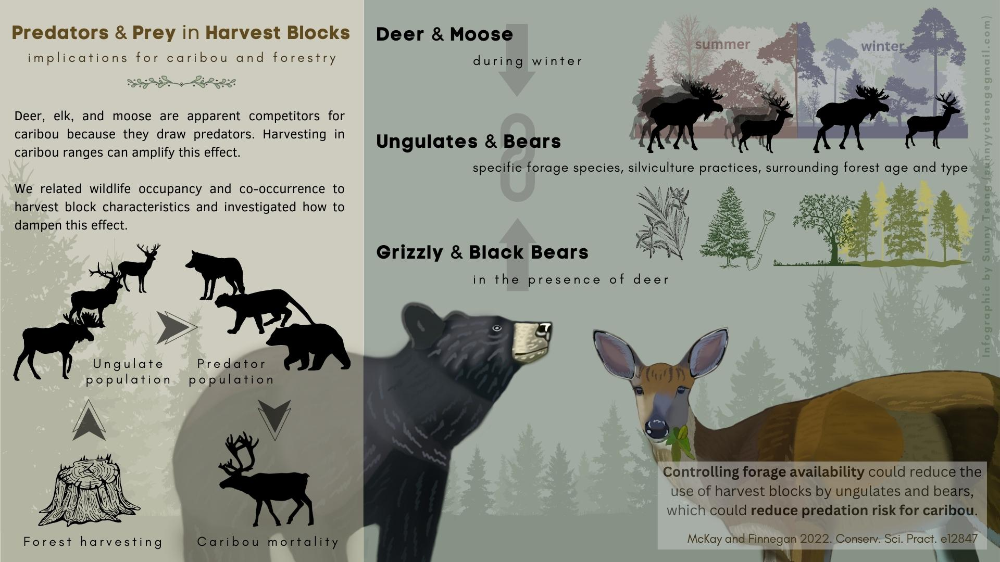
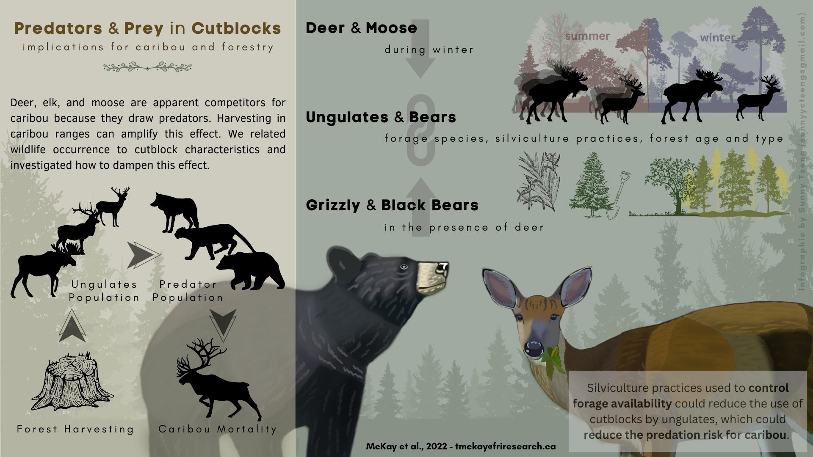

# Infographic for the predator-prey paper

## About

The paper is entitled "Predator-prey co-occurrence in harvest blocks: Implications for caribou and forestry", which is published in 2022 (McKay et al., 2023). The goal of this project is to create an infographic for this research paper!

## Paper infomation

- [Journal article](https://conbio.onlinelibrary.wiley.com/doi/pdf/10.1111/csp2.12847) 

- [Short note of research outcome](./docs_readme/shortnote.pdf)

## Product

### version 2 (2023.05.12)

Inforgraphic in different formats can be downloaded here: [PDF](docs_readme/infographic_predator_prey_Tracy_v2.pdf), [PNG](docs_readme/infographic_predator_prey_Tracy_v2.png), or [JPG](docs_readme/infographic_predator_prey_Tracy_v2.jpg).

### version 1 (2023.05.09)

## Time line

| Deliverable | Due | Review |
| ----------- | ------------- | ------ |
| Content and relevant info | Apr.14 (Fri.) |  |
| Draft of design | Apr.21 (Fri.) | agree on the draft |
| Visual design | Apr.28 (Fri.) |  |
| Text design | May.3 (Wed.) | review of the product |
| Revision(s) | May.10 (Wed.) |  |

## Tools

I will be using these two platforms for designing: 

- [GIMP](https://www.gimp.org/): an image editor for most of the visual design, including digital drawing.

- [Canva](https://www.canva.com/): a design tool for presentations and social media. I will be using canva for the text design. 

Example of my design style: 

## Expected output

- Dimension: 1920x1080 pixel (same dimension as the owl drawing above)
- Orientation: Horizental
- File type: PNG, JPEG, PDF

## Expected compensation

Between \$770 - \$870, with around 30-35 working hours expected for the work 

| Hours | Task |
| --- | --- |
| 4 | materials and infomation collection |
| 5 | communication |
| 12 | visual design |
| 4 | text design |
| 3 | review and final editing of the work |
| 2 | others |

## References

- [FUSE consulting company](https://www.fuseconsulting.ca/infographics)
- [FRI research](https://friresearch.ca/search/?frisearchable_posts%5BhierarchicalMenu%5D%5Btaxonomies_hierarchical.publication_type.lvl0%5D%5B0%5D=Summaries%20and%20Communications&frisearchable_posts%5BhierarchicalMenu%5D%5Btaxonomies_hierarchical.publication_type.lvl0%5D%5B1%5D=Infographics)

